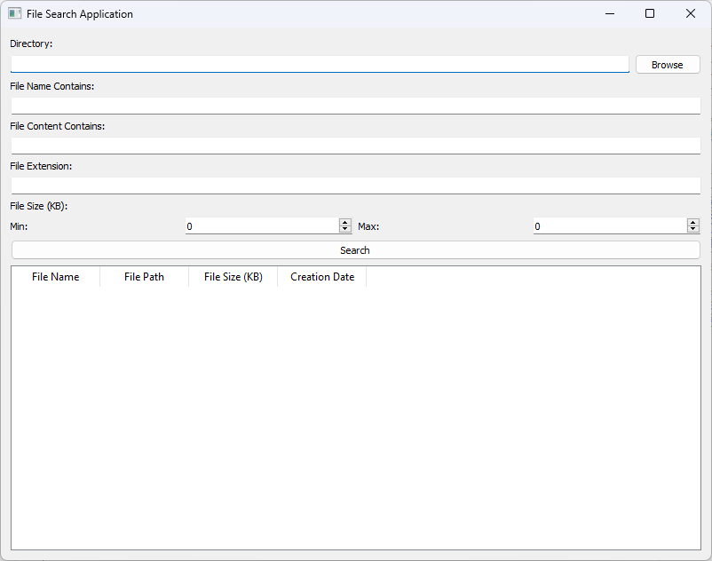

# File Search App

File Search App is a Python program with a graphical interface built using PyQt5 for searching files in a specified directory based on various criteria.

## Features

- Search files by name
- Search within file content
- Filter by file extension
- Search by file size range
- Directory selection for search
- Display results in a table with columns:
  - File Name
  - File Path
  - File Size
  - Creation Date
- Double-click to open a file
- Context menu options:
  - Open
  - Remove
  - Show in Explorer
  - Options

## Installation

1. Ensure you have Python 3.6 or higher installed.
2. Install the necessary libraries:
    ```bash
    pip install pyqt5
    ```

## Usage

1. Download and save the `main.py` file.
2. Run the program:
    ```bash
    python main.py
    ```
3. In the opened window:
    - Specify the directory to search.
    - Enter the search criteria (name, content, extension, size).
    - Click the "Search" button to start the search.
    - Search results will be displayed in the table.
    - Double-click a file to open it.
    - Right-click a row in the table to see the context menu with additional options.



## License

This project is licensed under the MIT License. See the [LICENSE](LICENSE) file for details.
